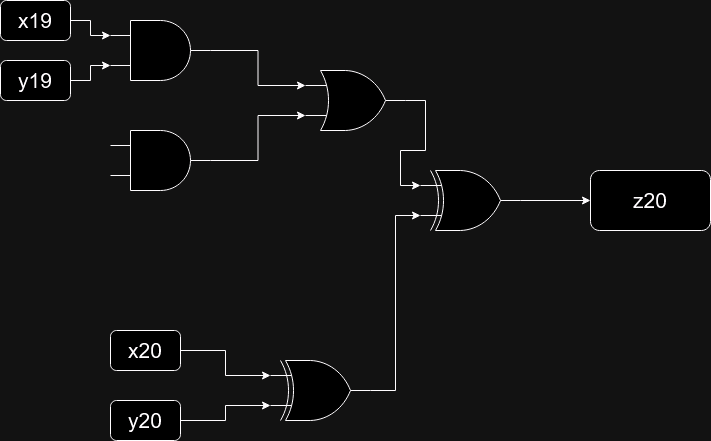

# Day 24: Crossed Wires

I stand corrected. THIS was the hardest challenge this year by a landslide. Not only for just the sheer amount of lines of code I wrote for this, but also for the fact that I couldn't reasonably find a way to do this with a specific algorithm. Instead I wrote a ton of helper algorithms to just assist with my discovery of the broken output wires and figured it out by deduction. This hard-coding-esque style was similar to my solving of the ill-fated [Day 22: Monkey Map](https://adventofcode.com/2022/day/22) (_shudder_), in that I had to hard-code certain things. I have to give credit where it's due though, I had to watch 0xdf's youtube video maybe 20 times before it really "clicked." And when it did, oh man what a wave of relief to be done with this nightmare.

Part one was straightforward, one of those "build this and show me the result" things. Evidently part one was solved by many cheaters ahead of time in about 9 seconds or so, mostly because these losers just copied the entire text into their LLM of choice and copied whatever code it spat out to get the answer. Unfortunately for those loser cheaters, part two actually involved using your brain, so at least there they were at a disadvantage. Regardless, knowing that certain wires needed to actually be "ready", as in have a registered digit in their value store, before they could be executed. To accomplish this, I just created a queueing system. All instructions go in the queue, and get pulled out one by one. If both the input and output state that they are ready, process the execution and discharge it from the queue. Otherwise, back to the end of the queue it goes. Once it did that, I just read the digits out of the Z bits and entered the answer. Not too bad, though I did over-engineer it a bit on the first go-round, which is why you see a "day24_firstattempt" directory. You can just go ahead and ignore that.

Once part one was finished, part two was substantially harder. Now you realize that the program you're running is an actual **adder** using only bitwise logic, but unfortunately it's broken. You have to find out exactly where it's broken and swap the outputs of 4 pairs of gates. The concept here was deceptively difficult.

I'll admit, I tried a whole bunch of weird ways to figure out the end result here. I figured the best way to find out where it was broken was by testing every single input and output bit and checking to see if it would validate, and if not then something must be messed up in the logic to that single bit. This was kind of the right way, but as I was coding I started to realize that I'm venturing off into this unknown strategy without any real tangible way to determine how to fix it once I figured out it was broken. Okay...

Eventually I managed to get the example input down, and it was mostly by brute-forcing the problematic output wires of all the gates until it would finally validate. This seemed like a sure-fire way to do it...until I realized that if I were to follow the same logic on the challenge data then it would take an unreasonable amount of time. I discovered that by obtaining all the permutations needed of potential gates to switch, the amount would have been `160!`, and that exclamation point is not because I'm excited, that's a _factorial_. The number that comes to far exceeds that of the amount of atoms in the known universe, so I think it's safe to say that this is not the way to solve this challenge. Man, I had a good feeling about that too.

Ultimately I figured out how to determine exactly _what_ bits were the problematic ones. I concocted a series of helper functions that would set the bits to exactly what I wanted, re-run the program in a blank slate with the new data and confirm that output validates properly. If it does then great, if not then I knew what bit I set it to where it didn't add properly, so at least I knew where to look at that point. Eventually it gave me a series of faulty bits that I could look at, so at least I had a place to start.

Next, I wrote a helper function to search backwards through the list of logic gates to find out all the gates that were connected. As expected, the higher up you go in the `z[0-9]{2}` bits, the more logic gates that you had to pass through. Since this was an adder that made sense that it would touch all of these gates beforehand, so I created a way to determine the unique gates that one z-digit would connect to by getting a diff of the same search from the z-digit below it. Now I at least had something to work with. And going through the list, I noticed that basically every single digit behaved in the same manner, utilizing the same set of logic circuits to add that digit. I then went completely analog and just drew the expected logical circuit out on my whiteboard on a digit that _wasn't_ misbehaving so I had a control at least, then went to all the digits where things _weren't_ working right. I compared every single logical circuit there and noticed anomalies. I took extensive notes and drew a ton of my whiteboard to find out all of the _weird_ gates that didn't make sense. Eventually I found four pairs! I put them in a string slice and sorted it, then joined it together with commas, and sure enough it was the answer.

I hope most of you have experienced what it is like to finish a challenge like this that has taken me over a week to solve. It's like all the weight of my self-doubt and inner dread just falls off my shoulders, allowing me to experience almost weightlessness. Tonight I will sleep well.

## Additional Info

I figured that instead of explaining my logic I would show my work. Given that each digit on the adder followed a very similar pattern for each digit (of course, cycling through each previous digit until it gets to the first one), I drew up the logical circuit that I used to determine where a broken gate existed:

This is of course after removing the linkage to the previous digits, as explained above. By diffing the similarities from one "z" digit to the previous one, I was able to remove a lot of the repetition and only focus on what makes this particular logical circuit not work properly. The result of the difference is what you see here. On a proper working adder circuit, this is what you can expect to see. In the above example, I chose the arbitrary z-digit of `z20` to illustrate its relation to several calculations on this circuit. Starting at the very bottom, each digit begins with the `XOR`ing of the coordinating `X` and `Y` wires, so in this case `x20` and `y20`. The result of that is fed into another `XOR` gate whose result is stored in the `z20` wire. On the above portion, the previous `X` and `Y` wires are `AND`ed together to be the operand of an `OR` gate, and the result of that `OR` is used as an operand of the `XOR` gate that ultimately makes up the digit on the appropriate `Z` wire. For each problematic digit I discovered, I simply used the above diagram to trace every single wire, and if they all lined up then that logical circuit was fine. But for the ones that didn't I just had to take notes as to what needed to be changed. Knowing that the previous `X` and `Y` digits are used in this diagram along with the current `X` and `Y` digits, you can pretty much trace everything based on your input.

I'm sure I can just code up how to do this following the above logic, but to be perfectly honest given the amount of code I wrote for this puzzle already I'm just tired of dealing with it. At least I can say that my helper functions played a tremendous role in solving this.